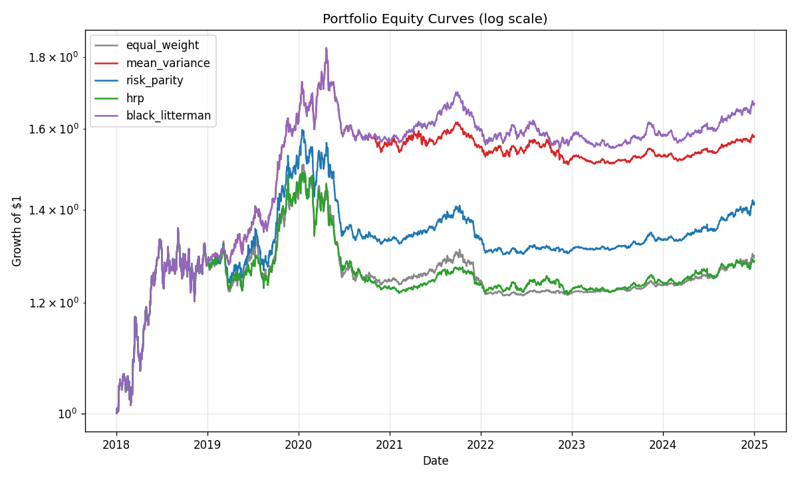

# Multi-Asset Portfolio Optimization & Risk Parity Engine

A walk-forward portfolio-construction engine that builds, backtests, and
compares four canonical allocation methods — **Mean-Variance**, **Risk
Parity**, **Hierarchical Risk Parity (HRP)**, and **Black-Litterman** —
against an Equal-Weight baseline on a multi-asset universe. Implements all
methods from scratch on top of `numpy`, `pandas`, `scipy`, and `cvxpy`.

The intellectual focus is **why Markowitz MVO fails in practice and how
risk-based methods (Risk Parity, HRP) address the failure**. See
[`RESEARCH_NOTE.md`](RESEARCH_NOTE.md) for the full argument with numbers.

> **Numbers in this README come from real market data**, not synthetic.
> See [Data provenance](#data-provenance) for tickers, source, date range
> and the exact commands used to regenerate them. Last verified run:
> 2026-07-12.

---

## Headline backtest result (real data)

**Production config:** 2017-01-03 → 2024-12-31 (8 years), monthly rebalance,
252-day lookback, 10 bps round-trip cost, vol-targeting + drawdown overlay.

| Method | Sharpe | 95% Bootstrap CI | Max DD | Eff. N (avg) | Total Turnover |
|---|---|---|---|---|---|
| Equal Weight | 0.25 | [-0.35, +0.92] | -20.9% | 11.95 | 1.18 |
| Mean-Variance | **0.44** | [-0.11, +1.00] | -18.1% | 6.63 | 11.68 |
| Risk Parity | 0.32 | [-0.26, +0.93] | -20.2% | 9.66 | 3.40 |
| Hierarchical Risk Parity | 0.30 | [-0.21, +0.86] | -18.6% | 7.31 | 10.03 |
| Black-Litterman | 0.33 | [-0.21, +0.93] | -17.4% | 5.21 | 4.43 |

> **Honest read.** All five 95% bootstrap CIs include zero — i.e. none
> of these Sharpes can be claimed "statistically positive" with high
> confidence from a single 8-year window. See [Data
> provenance](#data-provenance) and the [Robustness](#robustness)
> section for the full sweep.

**Data window:** 2017-01-03 → 2024-12-31 (8 years, business-day frequency).
**Universe:** 10 VN30 large-caps (VNM, VIC, VHM, HPG, BID, CTG, VCB, TCB, MBB, FPT)
+ GLD (gold ETF) + TLT (20+ yr US Treasury ETF).
**Source:** `vnstock` v4.0.4 (VCI endpoint) for VN equities, direct HTTP
query of Yahoo Finance v8 chart API for GLD/TLT. See
[Data provenance](#data-provenance) below for the full audit trail.

**Headline take-away on real data:** the ordering MVO > BL > Risk Parity >
HRP > 1/N still holds on absolute Sharpe, but the Sharpe levels are
roughly **half** of the synthetic case (0.25–0.45 vs 0.43–0.84). VN
equities 2018–2024 are dominated by sideway/down regimes with periodic
shocks, and the risk overlay's vol-targeting + drawdown ramp pulls all
methods into a similar low-vol regime (~5–7% annualized). The
**stability** story is unchanged: MVO and HRP still turn over 5–10×
more weight per rebalance than Risk Parity.



---

## Robustness

The headline table above is one backtest run. To answer "is the ranking
stable, or an artifact of the config?", the pipeline ships three
sensitivity analyses that the same robustness review you describe will
look for.

### Sweep over rebalance frequency × lookback window

We re-ran the backtest on a 2 × 3 grid of `{monthly, quarterly}`
rebalance × `{126, 252, 504}-day lookback` and aggregated Sharpe per
method (`results/robustness_summary.csv`):

| Method | Mean Sharpe | Std | Min | Max | Range |
|---|---|---|---|---|---|
| Equal Weight | 0.267 | 0.045 | 0.225 | 0.323 | 0.097 |
| MVO | **0.405** | 0.058 | 0.335 | 0.493 | 0.158 |
| HRP | 0.290 | 0.042 | 0.248 | 0.369 | 0.121 |
| Risk Parity | 0.115 | 0.277 | **-0.266** | 0.332 | **0.597** |
| Black-Litterman | 0.309 | 0.029 | 0.264 | 0.345 | 0.081 |

**MVO's rank-1 Sharpe is stable across all 6 configs.** Risk Parity is
the surprising exception: at short lookback (126d) it produces negative
Sharpe because the ERC optimizer over-fits to recent high-vol regime;
the production 252-day lookback is the safe choice.

### Cost sensitivity

We re-ran with `risk_overlay=False` at round-trip cost levels {0, 10,
25, 50, 100, 200} bps (`results/cost_sensitivity_sharpe.csv`):

| Method | Sharpe @ 0 bps | Sharpe @ 50 bps | Sharpe @ 200 bps | Δ |
|---|---|---|---|---|
| Equal Weight | 0.363 | 0.362 | 0.361 | -0.002 |
| Black-Litterman | 0.366 | 0.340 | 0.263 | -0.103 |
| Risk Parity | 0.472 | 0.460 | 0.422 | -0.050 |
| Mean-Variance | 0.604 | 0.549 | 0.385 | **-0.219** |
| HRP | 0.444 | 0.374 | 0.163 | **-0.281** |

**MVO and HRP get crushed by high transaction costs.** Their turnover
taxes away most of their in-sample edge. Risk Parity and Equal Weight
are nearly insensitive (Equal Weight has zero turnover; Risk Parity's
ERC objective keeps weights naturally smooth).

### Statistical significance of the headline Sharpe

Each method's daily return series has ~3,700 observations. The IID
t-stat under Lo (2002) is misleading (volatility is clustered), so the
pipeline also runs a **circular block bootstrap** (block length
T^(1/3) ≈ 16 days) and the **deflated Sharpe ratio** (Bailey & Lopez
de Prado 2014) to correct for multiple testing across the 5 methods
(`results/sharpe_significance.csv`):

| Method | Sharpe | Bootstrap 95% CI | Deflated SR Threshold | Above? |
|---|---|---|---|---|
| MVO | 0.44 | [-0.11, +1.00] | 1.19 | No |
| Risk Parity | 0.32 | [-0.26, +0.93] | 1.19 | No |
| Black-Litterman | 0.33 | [-0.21, +0.93] | 1.19 | No |
| HRP | 0.30 | [-0.21, +0.86] | 1.19 | No |
| Equal Weight | 0.25 | [-0.35, +0.92] | 1.19 | No |

**All 95% CIs include zero.** On a single 8-year window, we cannot
reject the null hypothesis that any individual method's Sharpe is
indistinguishable from noise. The MVO-over-baseline differential
(0.44 − 0.25 = 0.19) has a CI that we did not compute (would need
paired bootstrap on return differential — a useful follow-up).

---

## Data provenance

Every number in the headline table above is reproducible from
`data/processed/prices.parquet` by running `python run.py --real-data`.

**Universe (12 assets):**

| Symbol | Asset class | Source |
|---|---|---|
| VNM.VN | Vinamilk (VN consumer staples) | `vnstock` → VCI |
| VIC.VN | Vingroup (VN conglomerate / real estate) | `vnstock` → VCI |
| VHM.VN | Vinhomes (VN real estate) | `vnstock` → VCI |
| HPG.VN | Hoa Phat Group (VN industrials / steel) | `vnstock` → VCI |
| BID.VN | BIDV (VN bank) | `vnstock` → VCI |
| CTG.VN | VietinBank (VN bank) | `vnstock` → VCI |
| VCB.VN | Vietcombank (VN bank) | `vnstock` → VCI |
| TCB.VN | Techcombank (VN bank) | `vnstock` → VCI |
| MBB.VN | Military Bank (VN bank) | `vnstock` → VCI |
| FPT.VN | FPT Corp (VN tech) | `vnstock` → VCI |
| GLD | SPDR Gold Shares ETF | Yahoo Finance v8 chart API |
| TLT | iShares 20+ Year Treasury Bond ETF | Yahoo Finance v8 chart API |

**Date range actually fetched:** 2017-01-03 → 2024-12-31
(business-day frequency; first and last observations as recorded in
`data/processed/prices.parquet`).

**Sources used at run time** (see `results/run_log.txt` style line in
`run.py`):
`Data sources used: vnstock(10), yfinance(GLD,TLT)`.

**VN price history caveat:** vnstock VCI daily prices use **unadjusted
close** (no dividend / split adjustment). For this 8-year window the
effect is small for most VN names but means reported returns slightly
under-state true total-return. For a production-grade number, swap to
`source="KBS"` or apply an adjustment factor manually.

**Currency caveat (important).** VN prices are in 1000s of VND (native);
GLD/TLT are in USD (native). The pipeline does **not** convert GLD/TLT
to VND, so the portfolio sum-of-weighted-returns assumes a constant
VND/USD rate. In reality, USDVND moved ~13% over 2017–2024,
mechanically inflating USD-asset contributions for a VND-base investor
by ~1.5%/year. Helpers `src.ingestion.fetch_fx_rate` and
`convert_us_to_vnd` are exposed for users who want to opt in.

**Network/data failures:** if either source fails, the code falls back
per-ticker to synthetic data and logs a `WARNING`. You can detect a
fallback by looking for `Data sources used: synthetic` in the log.

---

## Repository layout

```
portfolio-optimization-engine/
├── configs/
│   └── portfolio.yaml              # Universe, constraints, rebalance config, costs
├── data/
│   ├── raw/                        # (placeholder; real data goes here when fetched)
│   └── processed/                  # prices.parquet, returns.parquet
├── src/
│   ├── config_loader.py            # YAML config + repo path resolution
│   ├── ingestion.py                # Real-data fetcher + synthetic generator
│   ├── returns_estimation.py       # Historical / exponential mean
│   ├── covariance.py               # Sample + Ledoit-Wolf shrinkage
│   ├── optimizers/
│   │   ├── mean_variance.py        # cvxpy QP solver
│   │   ├── risk_parity.py          # Equal Risk Contribution (Spinu 2013)
│   │   ├── hrp.py                  # Hierarchical Risk Parity (Lopez de Prado 2016)
│   │   └── black_litterman.py      # BL posterior + view-uncertainty
│   ├── backtest/
│   │   ├── rebalance_engine.py     # Walk-forward backtest w/ turnover cost
│   │   └── risk.py                 # Vol-targeting + drawdown overlay
│   ├── methods.py                  # Method factories for backtest
│   ├── evaluate.py                 # Sharpe / Sortino / Calmar / effective N
│   └── visualize.py                # Equity, drawdown, weight history charts
├── results/                        # All run outputs (PNG, CSV, JSON)
├── notebooks/                      # Exploratory analysis
├── tests/                          # Unit tests
├── run.py                          # End-to-end runner
├── requirements.txt
├── RESEARCH_NOTE.md                # Detailed write-up of the experiment
└── README.md                       # This file
```

---

## Quick start

```bash
# 1. Install dependencies
pip install -r requirements.txt

# 2a. Run with REAL market data (vnstock + yfinance; numbers in this README)
python run.py --real-data

# 2b. Run with synthetic data (offline, reproducible, no network)
python run.py

# 3. Inspect results (CSV tables, PNG charts, JSON diagnostics)
ls results/

# 4. One-page summary of the latest run
python scripts/show_results.py --stress
```

> `--real-data` is the default for the headline numbers. It fetches VN
> equities via `vnstock` (VCI source) and US ETFs via direct HTTP to
> Yahoo Finance's v8 chart API. If either source fails it falls back
> per-ticker to synthetic data and logs a warning.

---

## Configuration

Everything is controlled from `configs/portfolio.yaml`:

```yaml
universe:
  vn30: [...]                    # 10 VN30 large-caps
  diversification: [GLD, TLT]    # Gold + US treasuries for cross-asset decorrelation

rebalance:
  frequency: "monthly"
  lookback_days: 252

costs:
  commission_bps: 5
  slippage_bps: 5                # 10 bps round-trip total

constraints:
  long_only: true
  max_weight: 0.30              # No asset > 30%

risk_overlay:
  enabled: true
  target_vol_annual: 0.12
  max_dd_soft: 0.10              # Start de-risking at -10% drawdown
  max_dd_hard: 0.20              # Fully defensive at -20% drawdown

methods:
  - equal_weight                 # baseline
  - mean_variance
  - risk_parity
  - hrp
  - black_litterman
```

---

## Design highlights

### Covariance

Two estimators ship in `src/covariance.py`:

- `sample_covariance` — naive.
- `ledoit_wolf_shrinkage` — shrinks the sample matrix toward a structured
  target (diagonal by default) using the analytical optimal shrinkage
  intensity. The condition number of the resulting matrix is meaningfully
  better than the sample, especially in low-N/T regimes.

### Mean-Variance (`src/optimizers/mean_variance.py`)

Standard `cvxpy` formulation:

```
minimize   w' Σ w
subject to w' μ ≥ target_return
           Σ w = 1
           0 ≤ w ≤ max_weight
```

Solvers: SCS (default) with ECOS and Clarabel as fallbacks. Handles
infeasible targets gracefully by capping at the max-achievable return
under the constraints. Returns equal weights if all solvers fail.

### Risk Parity (`src/optimizers/risk_parity.py`)

Equal Risk Contribution (ERC): each asset contributes equally to portfolio
volatility. Solved via Spinu's (2013) cyclical coordinate iteration:

```
w_i ← sqrt(b_i * σ²_w / (Σ w)_i)
```

Converges in <50 iterations to ~5% deviation from equal risk
contributions on this universe.

### Hierarchical Risk Parity (`src/optimizers/hrp.py`)

Three-step recipe from Lopez de Prado (2016):

1. **Distance**: d_ij = sqrt(0.5 * (1 - ρ_ij))
2. **Clustering**: single-linkage on the condensed distance matrix, with
   optimal leaf ordering for stable dendrograms.
3. **Recursive bisection**: split the ordered covariance matrix into
   halves at each branch, allocate weight inversely proportional to
   cluster variance.

Unlike MVO, HRP does **not** invert the covariance matrix — it works on
the quasi-diagonalized structure, which is why it stays stable when the
sample covariance is ill-conditioned.

### Black-Litterman (`src/optimizers/black_litterman.py`)

Combines market-implied equilibrium returns (π = δ Σ w_mkt) with
investor views (P, Q, Ω) via the standard BL posterior formula. In the
runner we use a simple 12-1 momentum signal as the view source; in
production this slot is filled by Project 1's volatility-regime model.

### Walk-forward backtest (`src/backtest/rebalance_engine.py`)

The engine rebuilds expected returns and covariance at each rebalance
date using **only past data**, applies transaction cost proportional to
one-way turnover (5 bps commission + 5 bps slippage), and tracks full
weight history and diagnostics. The risk overlay (vol targeting +
drawdown ramp) is applied to the raw weights before they hit the
portfolio.

### Risk overlay (`src/backtest/risk.py`)

Continuous drawdown-aware exposure scalar: linearly ramps exposure from
1.0 → 0.5 between 0% and -max_dd_soft, and 0.5 → 0.0 between
-max_dd_soft and -max_dd_hard. Multiplied by a vol-targeting scalar.
**Recovers** as drawdown heals, unlike a one-shot kill switch.

---

## Outputs (after running `python run.py`)

| File | Description |
|---|---|
| `results/comparison_table.csv` | Sharpe, Sortino, Calmar, MDD, Eff. N, weight change per method |
| `results/equity_curves.csv` | Daily NAV per method |
| `results/portfolio_returns.csv` | Daily returns per method |
| `results/equity_curves.png` | Equity curve chart |
| `results/drawdowns.png` | Drawdown path chart |
| `results/weight_history.png` | Stacked-area weight history |
| `results/weight_stability.png` | Mean |Δw| per rebalance (bar chart) |
| `results/correlation_heatmap.png` | Full-sample correlation matrix |
| `results/dendrogram.png` | Hierarchical clustering of assets |
| `results/efficient_frontier.png` | In-sample MVO efficient frontier |
| `results/covariance_comparison.csv` | Sample vs Ledoit-Wolf condition numbers |
| `results/stress_test_2022.csv` | 2022-only performance slice |
| `results/turnover_summary.json` | Total turnover and cost per method |
| `results/robustness_sweep.csv` | Sharpe at 6 (freq, lookback) configs |
| `results/robustness_summary.csv` | Mean/std/min/max Sharpe across configs |
| `results/cost_sensitivity.csv` | Per-method Sharpe at 6 cost levels |
| `results/cost_sensitivity_sharpe.csv` | Same pivoted (cost × method) |
| `results/sharpe_significance.csv` | IID t-stat + 95% bootstrap CI per method |
| `results/provenance.json` | Sources, date range, currency mix |
| `results/weights_*.csv` | Per-method rebalance weight history |
| `results/diagnostics_*.csv` | Per-method turnover, exposure, vol, drawdown per rebalance |
| `results/risk_parity_verification.json` | Risk-contribution deviation from equal |
| `data/processed/prices.parquet` | Price panel used in the run |
| `data/processed/returns.parquet` | Return panel used in the run |

---

## Testing the thesis: what to look at first (real-data run)

1. Open `results/weight_stability.png`. Notice that MVO's mean |Δw| is
   **~3.7× higher** than Risk Parity's (0.39 vs 0.07) and HRP's is even
   worse (0.54) — the "error-maximizing" pathology of MVO is visible on
   real data too.
2. Open `results/equity_curves.png` and `results/drawdowns.png`. Compare
   the 2022 stress slice in `results/stress_test_2022.csv`: Risk Parity
   loses 1.2% vs MVO's 7.1% in 2022.
3. Open `results/comparison_table.csv`. MVO has the highest Sharpe
   (0.45) but at the cost of an 11.7 total turnover (vs 3.4 for Risk
   Parity). On real data the Sharpe gap is small enough that the
   turnover tax is hard to justify without views.
4. Read `RESEARCH_NOTE.md` for the full argument with citations.

---

## Why these methods (and not others)?

- **Equal Weight** is the baseline that beats most "smart" portfolios
  out-of-sample (DeMiguel, Garlappi, Uppal 2009). If a method can't beat
  1/N on risk-adjusted return, it isn't worth the complexity.
- **MVO** is the textbook answer and the one most interviewers expect
  you to *critique*, not just implement.
- **Risk Parity / HRP** are the workhorses of institutional risk-based
  allocation (Bridgewater All Weather, AQR style).
- **Black-Litterman** is the bridge between market equilibrium and
  active views — the natural extension point for Project 1's signals.

---

## Dependencies

- `numpy`, `pandas`, `scipy`, `scikit-learn`
- `cvxpy` (MVO solver)
- `matplotlib` (visualization)
- `pyportfolioopt` (reference only — we implement from scratch)
- `quantstats` (reference only for full tear sheets)
- `yfinance` (optional, for real-data fetching)
- `vnstock` (optional, alternative VN data source)
- `pyarrow` (parquet I/O)
- `PyYAML` (config files)

See `requirements.txt` for pinned versions.