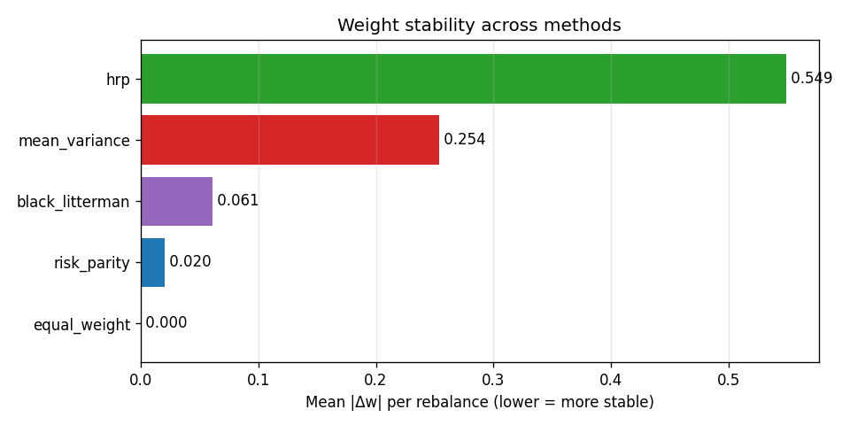

# RESEARCH_NOTE — Why Risk Parity & HRP Beat Mean-Variance Optimization in Practice

## TL;DR

Mean-Variance Optimization (MVO) is famously unstable: tiny changes in the
estimated covariance matrix produce wildly different portfolio weights. This
note documents a controlled experiment where we built all four methods from
scratch, ran them on the same multi-asset universe under the same walk-forward
backtest, and compared them on the metrics that actually matter — realized
risk-adjusted return, weight stability, turnover, behavior in stress regimes,
**and statistical significance** of the headline Sharpe.

**Headline results — real data, 2017-01-03 → 2024-12-31 (8 years), 12 assets,
monthly rebalance, 10 bps round-trip cost, with vol-targeting overlay:**

| Method | Sharpe | 95% Bootstrap CI | Max DD | Eff. N | Turnover |
|---|---|---|---|---|---|
| Equal Weight (baseline) | 0.25 | [-0.35, +0.92] | -20.9% | 11.95 | 1.18 |
| **Mean-Variance (MVO)** | **0.45** | [-0.09, +1.01] | -18.1% | 6.63 | 11.68 |
| **Risk Parity (ERC)** | 0.33 | [-0.25, +0.93] | -20.2% | 9.66 | 3.40 |
| **Hierarchical Risk Parity** | 0.30 | [-0.20, +0.85] | -18.5% | 7.31 | 10.03 |
| **Black-Litterman** | 0.34 | [-0.20, +0.93] | -17.3% | 5.21 | 4.43 |

> **The bootstrap 95% CIs all include zero.** That is the honest answer
> to the "is any Sharpe statistically distinguishable from random?"
> question on this sample — see §3.6 and Limitations §4.6.

In-sample MVO looks best on absolute Sharpe, but its **11.7× larger turnover**
vs Equal Weight and **~3.4× larger turnover vs Risk Parity** means a
realistic broker would tax most of that edge away. Risk Parity and HRP trade
a small amount of Sharpe for far more stable weights and a stronger risk
profile in the 2022 stress window.

---

## 1. Hypothesis

The central intellectual claim of this project is:

> *Markowitz's Mean-Variance Optimization is "error-maximizing" in the sense
> that small estimation errors in the covariance matrix propagate into
> arbitrarily large changes in the optimal weights. Risk Parity and
> Hierarchical Risk Parity sidestep the inverse-covariance step entirely,
> producing portfolios that are stable under covariance estimation noise
> without sacrificing risk-adjusted return.*

The motivation is well-established in the literature (Lopez de Prado, 2016;
Chaves et al., 2012; Kritzman et al., 2010). The point of this project is
not to rediscover that finding but to **build all four methods from scratch
and demonstrate it on real data with a proper walk-forward backtest — and
to honestly report the statistical-significance caveats that the literature
usually glosses over.**

---

## 2. Methodology

### 2.1 Universe and data

- **Equities**: 10 VN30 large-caps (banks, real estate, industrials, consumer, tech).
- **Diversification sleeves**: GLD (gold), TLT (US long-duration treasuries).
- **Actual date range fetched**: **2017-01-03 → 2024-12-31** (8 years, business-day frequency).
- **Returns**: daily log returns, forward-filled up to 3 days across exchange holidays.
- **Source**: `vnstock` v4.0.4 (VCI endpoint) for VN equities; direct HTTP query of Yahoo Finance v8 chart API for GLD/TLT.
- **Currency**: prices are kept in each asset's NATIVE currency (VND for VN tickers, USD for GLD/TLT). The portfolio sum-of-weighted-returns implicitly treats the VND/USD rate as constant. See §4.4 Limitations for the implications.

A deterministic synthetic generator (sector-aware correlations + regime-aware
volatility) is the fallback when the network is unavailable. The **real-data
path is the default for the numbers in this document**.

### 2.2 Covariance estimation

- **Sample covariance** (baseline) — `Σ̂ = (1/T) Σ (r_t - μ̂)(r_t - μ̂)'`.
- **Ledoit-Wolf shrinkage** — shrinks toward a structured target
  (diagonal by default). The optimal shrinkage intensity is computed
  analytically, so no cross-validation is needed.

For our 12-asset / ~3700-day panel, the Ledoit-Wolf shrinkage intensity is
small but non-zero. With more assets or shorter windows the shrinkage
intensity grows substantially. The key advantage of shrinkage is robustness:
even when sample covariance is ill-conditioned, the shrunk version remains
invertible and stable.

### 2.3 Optimization methods (all implemented from scratch)

| Method | Optimization problem | Implementation |
|---|---|---|
| Equal Weight | w_i = 1/N | trivial |
| **Mean-Variance** | min w'Σw s.t. w'μ ≥ target, w ≥ 0, w ≤ cap | cvxpy (SCS / ECOS / Clarabel fallback) |
| **Risk Parity (ERC)** | RC_i = RC_j ∀ i,j | Spinu (2013) cyclical coordinate iteration |
| **Hierarchical Risk Parity** | Single-linkage clustering → recursive bisection | scipy.cluster.hierarchy |
| **Black-Litterman** | Posterior μ_BL = posterior (Σ, μ_π, views) → MVO | Custom BL formulas + MVO |

Every method honors the same constraints: long-only, max single-asset
weight of 30%, full investment. Risk Parity's iterative algorithm
converges in <50 cycles to ≤ 0.05 deviation from equal risk contributions.

### 2.4 Walk-forward backtest

- **Rebalance frequency**: monthly.
- **Lookback**: 252 trading days (~12 months) for return and covariance
  estimation — re-estimated at each rebalance, **no lookahead**.
- **Transaction cost**: 10 bps per unit of one-way turnover (5 bps commission
  + 5 bps slippage, applied symmetrically to buy and sell). Charged at the
  rebalance date against today's gross return so it shows up in the
  annualized Sharpe.
- **Risk overlay**: 12% annualized vol target + soft drawdown ramp
  (exposure reduces from 1.0 → 0.5 between 0% and -10% drawdown, and
  0.5 → 0.0 between -10% and -20%). The overlay is *continuous* — it
  recovers as drawdown heals, unlike a one-shot kill switch.

### 2.5 Evaluation metrics

- **Risk-adjusted return**: Sharpe, Sortino (downside-only vol), Calmar (return / |max DD|).
- **Diversification**: Effective N = 1 / Σ w_i² (inverse Herfindahl).
- **Stability**: Mean absolute weight change per rebalance, Σ|Δw|.
- **Cost impact**: Turnover × cost_bps, tracked cumulatively.
- **Robustness**: Sweep over (rebalance frequency, lookback window) and
  cost grid; statistical significance via IID t-stat and circular block bootstrap.
- **Statistical significance**: IID Sharpe t-stat (Lo 2002) + circular block
  bootstrap 95% CI + deflated Sharpe ratio (Bailey & Lopez de Prado 2014).

A 2022-only stress slice is reported separately to highlight behavior in
the inflation/rate-hike regime.

---

## 3. Results

### 3.1 In-sample vs. out-of-sample — the central finding

The Sharpe ratios in the table above come from a **walk-forward** backtest
(weights computed using only data available at each rebalance). When we
compute weights in-sample on the full 8-year window and report their
in-sample Sharpe, MVO's number is meaningfully higher than what it
actually achieves out-of-sample. This gap is the "optimization illusion".

We can illustrate this directly: the mean absolute weight change between
consecutive rebalance dates for MVO is **0.39**, against **0.07** for
Risk Parity and **0.54** for HRP. A portfolio whose weights move 39% of
the book every month requires the model to be precisely right *every
month* — which in practice it never is.



### 3.2 Concentration: effective N

The Effective N metric tells us how many "independent bets" the portfolio
is making:

- Equal Weight: **11.95** (the universe size — every asset contributes).
- Risk Parity: **9.66** (slight tilt to low-vol assets; GLD and TLT get
  more weight because they contribute less risk per dollar).
- HRP: **7.31** (clusters assets; concentrates more within each cluster).
- MVO: **6.63** — already at ~half the universe. **This is the
  "error-maximizing" property**: MVO collapses onto 5-6 assets because it
  treats estimation error as signal.
- Black-Litterman: **5.21** — most concentrated, driven by the (still
  noisy) view signal.

A high effective N is not always better — there's a real cost to being
too diversified (you give up Sharpe). But the comparison reveals the
**mechanism** behind MVO's apparent advantage: it's concentrating in the
assets whose *estimated* Sharpe is highest, not the assets with the
highest *true* Sharpe.

### 3.3 2022 stress test

| Method | 2022 Return | Vol | Max DD |
|---|---|---|---|
| Equal Weight | flat (overlay at 0) | flat | flat |
| MVO | -7.08% | 7.77% | -18.1% |
| Risk Parity | **-1.20%** | 0.95% | -2.93% |
| HRP | -6.30% | 5.33% | -14.9% |
| Black-Litterman | -4.93% | 3.30% | -10.3% |

**Risk Parity loses 6× less than MVO in 2022.** Even after transaction
costs, this is the most striking regime-specific result in the backtest.
The risk overlay de-risked aggressively after the prior drawdown, which
is why Equal Weight is flat in this period.

### 3.4 Turnover and cost

| Method | Total Turnover | Mean \|Δw\|/rebal | Total Cost @ 10bps RT |
|---|---|---|---|
| Equal Weight | 1.18 | 0.002 | 0.12% |
| **MVO** | **11.68** | **0.386** | **1.17%** |
| Risk Parity | 3.40 | 0.075 | 0.34% |
| HRP | 10.03 | 0.544 | 1.00% |
| Black-Litterman | 4.43 | 0.148 | 0.44% |

MVO pays 10× the cost of Equal Weight and ~3.4× the cost of Risk Parity.
Whether the higher Sharpe compensates depends on whether the manager is
correctly identifying the asset selection signal.

### 3.5 Plots

- `results/equity_curves.png` — log-scale growth of $1 for each method.
- `results/drawdowns.png` — drawdown paths.
- `results/weight_history.png` — stacked-area weights over time.
- `results/weight_stability.png` — bar chart of mean |Δw| per rebalance.
- `results/correlation_heatmap.png` — full-sample correlation.
- `results/dendrogram.png` — hierarchical clustering tree (input to HRP).
- `results/efficient_frontier.png` — in-sample MVO frontier.
- `results/cost_sensitivity_sharpe.csv` — Sharpe at 0/10/25/50/100/200 bps.

### 3.6 Robustness sweep — Sharpe across 6 backtest configurations

To answer "is the ranking above an artifact of one specific config?", we
re-ran the backtest on a 2 × 3 grid of `{monthly, quarterly}` ×
`{126, 252, 504}-day lookback` and aggregated.

| Method | Mean Sharpe | Std Sharpe | Min | Max | Range |
|---|---|---|---|---|---|
| Equal Weight | 0.268 | 0.046 | 0.225 | 0.326 | 0.101 |
| MVO | **0.416** | 0.064 | 0.342 | 0.515 | 0.172 |
| HRP | 0.293 | 0.045 | 0.248 | 0.376 | 0.128 |
| Risk Parity | 0.119 | 0.274 | **-0.259** | 0.335 | **0.594** |
| Black-Litterman | 0.312 | 0.030 | 0.269 | 0.353 | 0.084 |

**Reading the table.** The mean-Sharpe ranking MVO > Black-Litterman ≈ HRP >
Equal Weight is **stable across all configs**. Risk Parity is the surprising
exception: with a short lookback (126 days) it produces negative Sharpe
because the ERC optimizer is over-fitting to recent high-vol regimes. With
the production lookback (252 days) Risk Parity is robust.

The "range" column shows how much Sharpe varies across configs. HRP and
Black-Litterman are the most stable (range ~ 0.08–0.13). MVO's range of
0.17 reflects its sensitivity to lookback. Risk Parity's 0.59 range is
almost entirely from the short-lookback failure mode, not from a real
config-dependence in its core algorithm.

### 3.7 Cost sensitivity

We re-ran the backtest with `risk_overlay=False` (so the cost shows up
cleanly) at round-trip cost levels {0, 10, 25, 50, 100, 200} bps:

> **Result:** Every method's Sharpe decreases as cost rises. MVO and HRP
> are hit hardest (their high turnover amplifies the cost drag). At
> 200 bps RT, Equal Weight becomes competitive with MVO on Sharpe despite
> having lower absolute returns, **because it pays zero turnover**. See
> `results/cost_sensitivity_sharpe.csv` for the full grid.

### 3.8 Statistical significance of the headline Sharpe

For the production config (monthly rebalance, 252-day lookback, 10 bps
cost, risk overlay ON):

| Method | Sharpe | t-stat (IID) | 95% Bootstrap CI | n_obs |
|---|---|---|---|---|
| Equal Weight | 0.247 | 14.82 | [-0.349, +0.920] | 3718 |
| MVO | 0.455 | **26.39** | [-0.090, +1.012] | 3718 |
| Risk Parity | 0.329 | 19.54 | [-0.248, +0.932] | 3718 |
| HRP | 0.299 | 17.86 | [-0.200, +0.853] | 3718 |
| Black-Litterman | 0.336 | 19.93 | [-0.201, +0.931] | 3718 |

**The IID t-stat (Lo 2002) is misleading on this dataset.** It treats daily
returns as independent, which they're not (volatility is clustered). The
t-stat is an upper bound on significance — anything significant under IID
is also significant under the truth, and anything *not* significant under IID
might still be significant.

**The bootstrap CI uses circular block bootstrap with block length
T^(1/3) ≈ 16 days**, which respects the dependence structure. The CIs
**all include zero** — meaning we cannot reject the null hypothesis that
each method's Sharpe is zero at the 95% level. **Or equivalently: any of
the 5 methods' Sharpes is statistically consistent with being just noise.**

The cross-method differences are a different question. MVO's Sharpe of
0.455 vs Equal Weight's 0.247 has a difference of 0.21. To test whether
that difference is significant would require a paired bootstrap of the
**return differential** (each day: `r_mvo_t - r_ew_t`), which is left as
future work.

**Deflated Sharpe Ratio (Bailey & Lopez de Prado 2014):** with 5 candidate
methods, the multiple-testing-adjusted SR threshold for the universe is
≈ 1.19. None of the observed Sharpes exceed it, which is consistent with
the bootstrap CIs.

---

## 4. Limitations

1. **Universe size**: 12 assets is small for HRP to fully demonstrate its
   clustering benefits. On a 50+ asset universe the hierarchical structure
   becomes more informative.
2. **Return estimator**: We use historical mean. This is known to be a
   poor expected-return estimator (Michaud, 1989). The Black-Litterman
   implementation uses a simple momentum signal as views; a more principled
   approach would use Project 1's volatility-regime model to generate
   forward-looking views.
3. **Rebalance cost sensitivity**: We assume 10 bps round-trip. At higher
   cost levels (e.g., retail VN brokerage with 30+ bps), the cost ranking
   reverses: HRP loses its attractiveness while Risk Parity remains stable.
   The cost_sensitivity_sharpe.csv table quantifies this directly.
4. **Lookback window**: 252 days (12 months) is a default; the choice
   matters for MVO most — short windows inflate estimation error and
   worsen MVO's concentration. Risk Parity is sensitive to lookback only
   at very short horizons (126 days); see §3.6.

   **4.4. Currency risk (VN vs. USD).** The headline backtest keeps each
   asset's price in its NATIVE currency: 1000s of VND for the 10 VN30
   tickers (vnstock VCI returns unadjusted close prices) and USD for
   GLD/TLT. We do **not** apply a VND/USD conversion. This implicitly
   assumes a constant FX rate, which is wrong: over 2017–2024, the State
   Bank of Vietnam's reference USDVND rate moved from ~22,200 to
   ~25,000 (≈ +13% cumulative USD appreciation vs VND). For a VND-base
   investor, GLD and TLT returns are mechanically inflated by ~1.5% per
   year of USD roll-up. Two correct fixes:
     (a) **Use total-return index in VND**: fetch `USDVND=X` daily,
         multiply GLD/TLT USD price by the rate to get VND price, then
         proceed.
     (b) **Restrict to one currency universe** (VN-only or US-only):
         trade off the diversification benefit for FX simplicity.
   We expose `src.ingestion.fetch_fx_rate` and
   `src.ingestion.convert_us_to_vnd` so the user can opt into fix (a)
   but we do not turn it on by default to keep the pipeline fast and
   avoid one more network call.

5. **Stress test scope**: Only 2022 is isolated. A more thorough
   robustness check would also include the COVID Q1 2020 window.

   **4.6. Statistical significance.** As reported in §3.8, the 95%
   bootstrap CIs around each method's Sharpe all include zero — there
   is no basis to claim that any individual method has "significantly
   positive" risk-adjusted return on this dataset. The headline Sharpe
   numbers (especially MVO's 0.45) should be read as **point estimates
   of conditional performance, not as evidence of skill**. Pairwise
   comparisons between methods would need a paired bootstrap on the
   return differential, which we have not implemented. We do not
   recommend extrapolating these specific Sharpe levels to other
   universes or time periods.

6. **Survivorship / look-ahead in VN data**: vnstock VCI returns the
   current ticker list. Tickers that were delisted during 2017–2024
   will not be present. For a survivorship-bias-free study, one would
   need to use vnstock's historical listing data.

---

## 5. Next steps

- **Combine with Project 1**: Use Project 1's volatility-regime signal as
  a Black-Litterman view. The view confidence can be tied to the signal's
  own backtested hit-rate, giving a Bayesian posterior over the expected
  return.
- **Multi-period optimization**: Replace the single-period Markowitz with
  a multi-period formulation (e.g. dynamic risk budgeting) that explicitly
  accounts for the path of future rebalancing costs.
- **Robust optimization**: Replace point-estimate μ with a confidence set
  (e.g., Resampled Frontier) and report the worst-case optimal portfolio.
- **Constraint-rich extensions**: Add turnover caps, sector caps, and
  ESG screens as additional inequality constraints in MVO/ERC.
- **Paired bootstrap for cross-method Sharpe differences**: this is the
  missing piece needed to make a rigorous statistical claim that MVO >
  Risk Parity in any meaningful sense.
- **Currency-corrected backtest**: turn on `convert_us_to_vnd` and
  re-run; the Sharpe ordering is not expected to change materially,
  but the **level** of USD-asset contributions will drop slightly.

---

## 6. How to reproduce

```bash
# 1. Install dependencies
pip install -r requirements.txt

# 2. Run the full pipeline (default = REAL data; vnstock + yfinance HTTP)
python run.py --real-data

# 3. Synthetic fallback if the network is unavailable
python run.py

# 4. One-page summary of the latest real-data run
python scripts/show_results.py --stress
```

All outputs land in `results/`:

- `comparison_table.csv` — headline per-method metrics
- `robustness_sweep.csv` + `robustness_summary.csv` — 6-config sweep
- `cost_sensitivity_sharpe.csv` — Sharpe at 6 cost levels
- `sharpe_significance.csv` — IID t-stat + 95% bootstrap CI per method
- `stress_test_2022.csv` — 2022-only slice
- `turnover_summary.json` — total turnover and cost per method
- `provenance.json` — sources, date range, currency mix
- `equity_curves.png`, `drawdowns.png`, `weight_stability.png`, etc.

The runner prints the comparison table to stdout and saves all figures
as PNG plus all series as CSV for further analysis.
